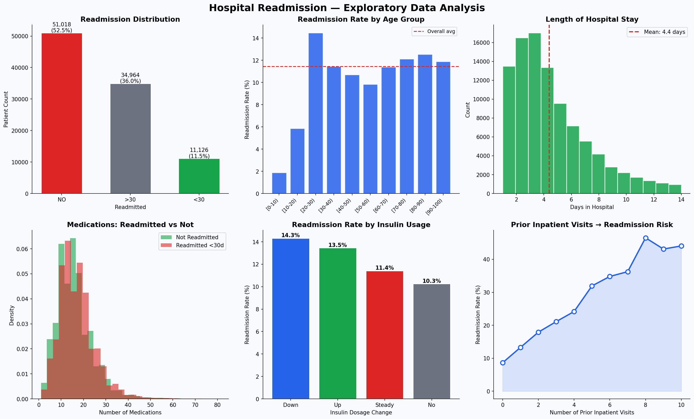
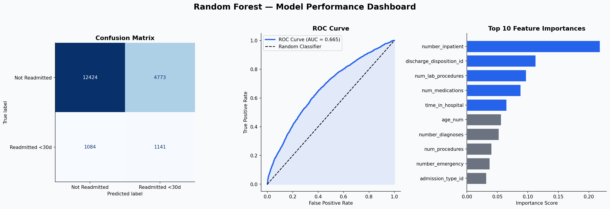

# Hospital_readmission_prediction
# 🏥 Hospital Readmission Prediction
### Diabetes 130-US Hospitals Dataset (1999–2008)

Predicting early hospital readmission (within 30 days) for diabetic patients using clinical encounter data from 130 US hospitals. Built to support healthcare resource planning and proactive patient care.

---

## 📌 Problem Statement

Hospital readmissions within 30 days are costly for both patients and healthcare systems. This project identifies patients at high risk of early readmission using machine learning, enabling hospitals to prioritize follow-up care and reduce preventable returns.

---

## 📊 Dataset

| Detail | Value |
|---|---|
| Source | [UCI ML Repository — Diabetes 130-US Hospitals](https://archive.ics.uci.edu/ml/datasets/diabetes+130-us+hospitals+for+years+1999-2008) |
| Time Period | 1999 – 2008 |
| Rows | 101,766 patient encounters |
| Features | 50 (demographics, medications, lab results, diagnoses) |
| Target | Readmitted within 30 days (binary) |

---

## 🔍 Exploratory Data Analysis



**Key Findings:**
- Only **11.5%** of patients were readmitted within 30 days — a class-imbalanced problem
- Patients aged **70–90** showed the highest readmission rates
- Higher **number of inpatient visits** strongly correlates with readmission risk
- Patients on **insulin (Up dosage)** had elevated readmission rates
- Average hospital stay: **4.4 days**

---

## ⚙️ Methodology

### Data Cleaning
- Replaced `?` placeholders with `NaN`
- Dropped high-missing columns: `weight` (97% missing), `payer_code`, `medical_specialty`
- Removed expired/hospice discharges (not relevant for readmission modeling)
- Encoded `age` as ordinal (10 brackets → 0–9)
- Filled `max_glu_serum` and `A1Cresult` with `'None'` (clinically: not tested)

### Feature Engineering
- **22 features** selected across 4 categories:
  - Patient demographics (age, race, gender)
  - Hospital utilization (time in hospital, prior visits, procedures)
  - Medication data (insulin, metformin, glipizide, glyburide + 4 others)
  - Lab results (A1C, glucose serum)

### Model
- **Random Forest Classifier** (200 trees, max depth 12)
- `class_weight='balanced'` to handle class imbalance
- 80/20 train-test split, stratified

---

## 📈 Results



| Metric | Score |
|---|---|
| ROC-AUC | **0.665** |
| Accuracy | 69.8% |
| Precision (readmitted) | 19% |
| Recall (readmitted) | 51% |
| F1 Score (readmitted) | 0.28 |

> **Note:** Low precision on the minority class is expected with 11.5% readmission rate. The model is optimized for recall — catching as many true readmissions as possible — which is the clinically correct priority.

### Top Predictive Features
1. `number_inpatient` — Prior inpatient visits
2. `num_medications` — Number of medications prescribed
3. `time_in_hospital` — Length of current stay
4. `num_lab_procedures` — Number of lab tests ordered
5. `discharge_disposition_id` — Where patient was discharged to

---

## 🛠️ Tech Stack


---

## 🚀 How to Run

```bash
# Clone the repo
git clone https://github.com/dheerajkranthi-Stevens/hospital-readmission-prediction.git
cd hospital-readmission-prediction

# Install dependencies
pip install pandas numpy matplotlib seaborn scikit-learn

# Download dataset from Kaggle
# https://www.kaggle.com/datasets/brandao/diabetic

# Run the pipeline
python hospital_readmission.py
```

---

## 📁 Project Structure

```
hospital-readmission-prediction/
│
├── hospital_readmission.py   # Full pipeline: cleaning → EDA → model
├── eda_dashboard.png         # 6-panel exploratory analysis
├── model_performance.png     # Confusion matrix, ROC curve, feature importance
└── README.md
```

---

## 💡 Future Improvements

- Try XGBoost / LightGBM for better AUC
- Apply SMOTE oversampling to address class imbalance
- Add diagnosis code grouping (ICD-9 → disease categories)
- Deploy as a Streamlit risk-scoring dashboard

---

## 👤 Author

**Dheeraj Kranthi**  
M.S. Business Intelligence & Analytics — Stevens Institute of Technology  
[GitHub](https://github.com/dheerajkranthi-Stevens) | [LinkedIn](https://linkedin.com/in/dheerajkranthi)
